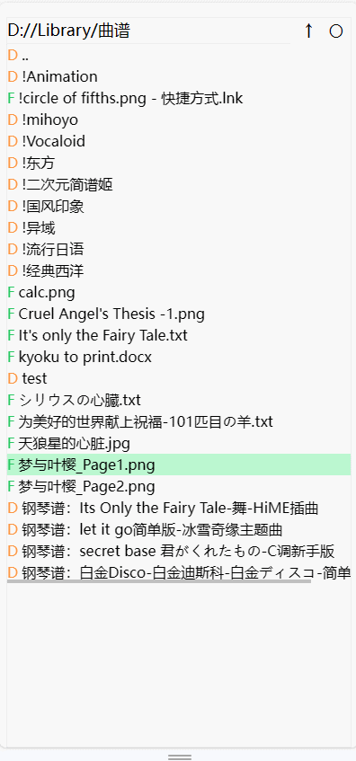

## webpViewer
原意是有不少图片是webp格式，windows无法直接查看，每次一张张用浏览器打开很麻烦，就想整一个能快捷翻页的js脚本。结果写着写着用上了express，支持了其他图片格式，也加了一些快捷键，适配了手机端。

现在的样子更像是一个文件浏览器，代码基于solidjs+tsx，支持用其他设备浏览目标设备的文件图片（用手机看电脑上的图片）。样式比较简陋，主打一个凑合Ψ(￣∀￣)Ψ

## screenshot

  
  
mobile demo v0.3.1

## TODO
- [x] 列出目录内容时支持按时间排序
- [ ] 每个目录独立持有一个SortType store.currentDir
- [x] 读取package.json并在命令行输出版本号
- [ ] 临时文本上传
- [x] 文本内容复制
- [x] textpanel: + padding
- [ ] textpanel: + 编辑功能
- [x] 随机选择
- [ ] 优化滑动翻页
- [x] 页面标题随打开的文件夹变化
- [ ] 优化blob读取: 预加载/缓存(blob)
- [x] 支持html浏览
- [x] 支持mhtml浏览
- [x] 文件上传
- [x] 滑动翻页
- [ ] 支持linux，windows盘符选择 https://github.com/cristiammercado/node-disk-info, 或者由用户手动确定根目录/下面的一级目录内容

## shortcut
### common
- fileexplorer右上方: ↑返回上一级目录，〇刷新
- 点击datapanel上方: 显示/隐藏文件信息与下载按钮（即文件名）

### keyboard
- ws: 切换浏览的文件
- ad: 切换功能界面

### gesture
- 上/下滑动： 切换浏览的文件
- 左/右滑动: 切换功能界面
- 双指缩放: 放大缩小

## use (windows)
### install from source
1. open terminal
2. git clone
3. cd webpViewer
4. pnpm i
5. pnpm build
6. go build -C server/v3
7. webpViewer.ps1

### release
1. download release
2. unzip
3. webpViewer.ps1
