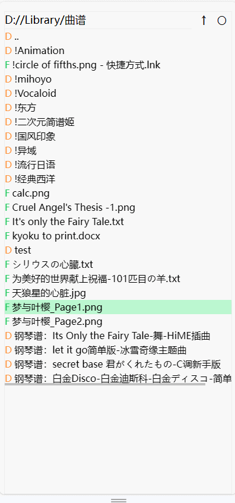

## webpViewer
原意是有不少图片是webp格式，windows无法直接查看，每次一张张用浏览器打开很麻烦，就想整一个能快捷翻页的js脚本。结果写着写着用上了express，支持了其他图片格式，也加了一些快捷键，适配了手机端。

现在的样子更像是一个文件浏览器，代码基于solidjs+tsx，支持用其他设备浏览目标设备的文件图片（用手机看电脑上的图片）。样式比较简陋，主打一个凑合Ψ(￣∀￣)Ψ

## screenshot

## shortcut
### common
- fileexplorer右上方: ↑返回上一级目录，〇刷新
- 点击datapanel上方: 显示/隐藏文件信息与下载按钮（即文件名）

### keyboard
- ws: 切换浏览的文件
- ad: 切换功能界面

### gesture
- 上/下滑动： 切换浏览的文件
- 左/右滑动: 切换功能界面
- 双指缩放: 放大缩小

## use (windows)
### install from source
1. open terminal
2. git clone
3. cd webpViewer
4. pnpm i
5. pnpm build
6. webpViewer.ps1

### release
1. download release
2. unzip
3. download webpViewer.ps1
4. mv webpViewer.ps1 release/webpViewer.ps1
5. pnpm i express
6. webpViewer.ps1
